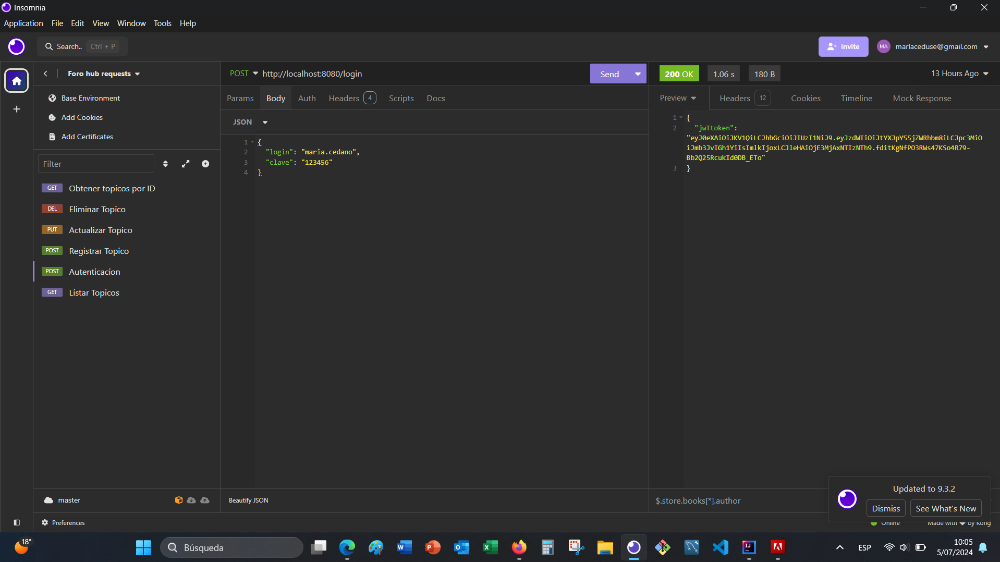
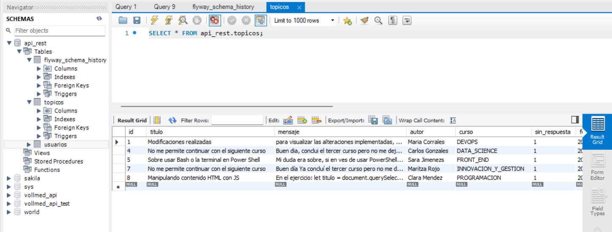
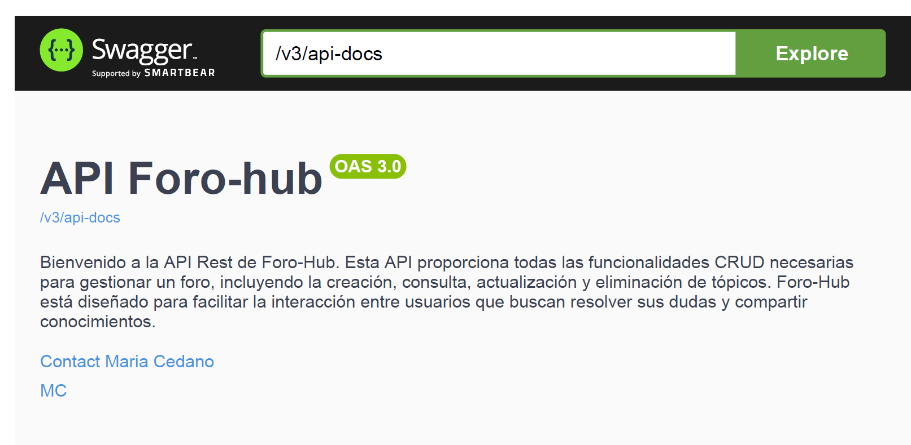
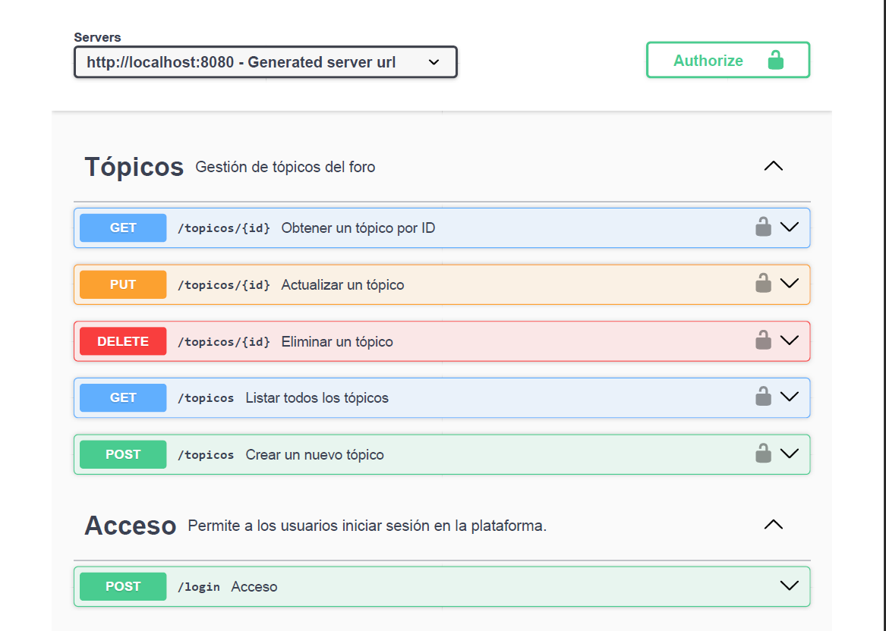

# <h1 align="center">FORO-HUB API REST </h1>

## 
Introducción

Bienvenido a la API Rest de Foro-Hub. Esta API proporciona todas las funcionalidades CRUD necesarias para gestionar un foro, incluyendo la creación, consulta, actualización y eliminación de tópicos. Foro-Hub está diseñado para facilitar la interacción entre usuarios que buscan resolver sus dudas y compartir conocimientos.

## 
Funcionalidades

- `  Consultas Dinámicas: `
Permite a los usuarios buscar tópicos específicos por diferentes criterios, facilitando la resolución de dudas.

- ` Interacción de Usuarios: `Los usuarios pueden responder a los tópicos, proporcionando soluciones y compartiendo conocimientos.

## 
Operaciones CRUD:

`1` **Iniciar sesión:** Autenticación de usuarios con nombre de usuario y contraseña.

`2` **Crear un tópico:** Permite a los usuarios crear nuevos tópicos en el foro.

`3` **Listar todos los tópicos:** Muestra una lista de todos los tópicos disponibles.

`4` **Revisar tópico por ID:** Obtiene los detalles de un tópico específico mediante su ID.

`5` **Actualizar tópico:** Permite la actualización de la información de un tópico existente.

`6` **Eliminar tópico:** Elimina tópicos no deseados del foro.

## 
Tecnologías Utilizadas

- IDE (Entorno de desarrollo integrado) IntelliJ IDEA
- Spring Boot 3 <a>https://start.spring.io/</a> 
- Lenguaje de programación: Java 17, 
- Gestor de dependencia: Maven 8
- Base de datos: MySQL 8
- JPA (Java Persistence API)
- Seguridad: Spring Security
- Pruebas de API: Insomnia  <a>https://insomnia.rest/</a> 
- Autenticación: JSON web token  <a>https://jwt.io/</a> 
- Documentación: SpringDoc y Swagger UI
- Formación: Alura Latam, curso: JAVA y SPRING BOOT 3 <a>https://www.aluracursos.com/</a> 

 

 

 

 

 

